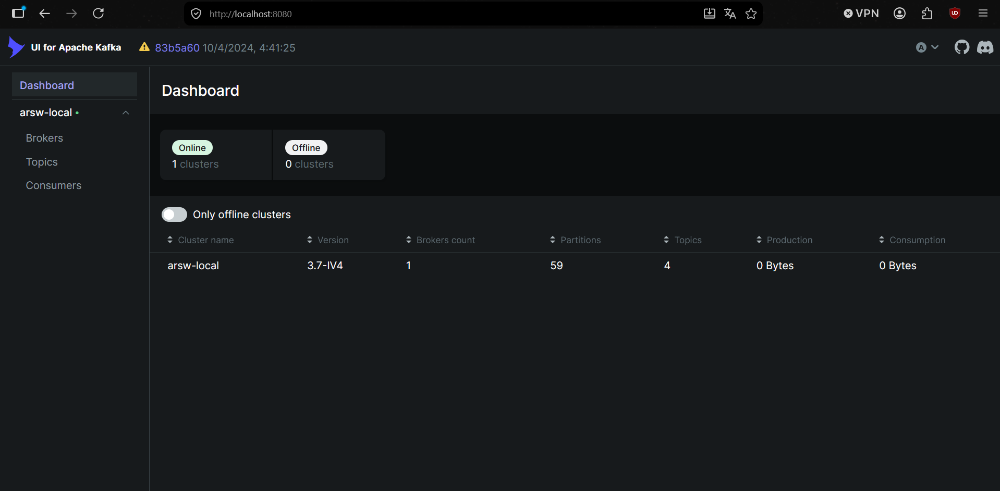
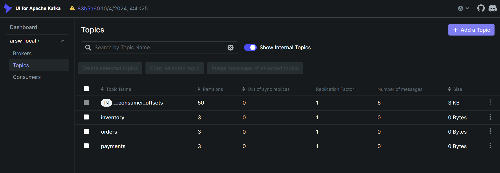
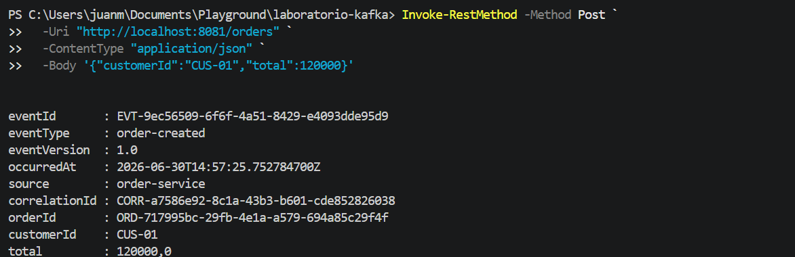
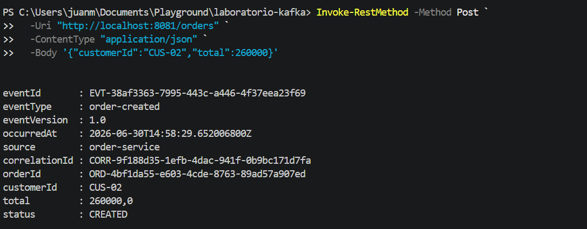
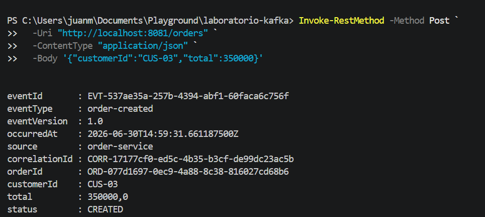
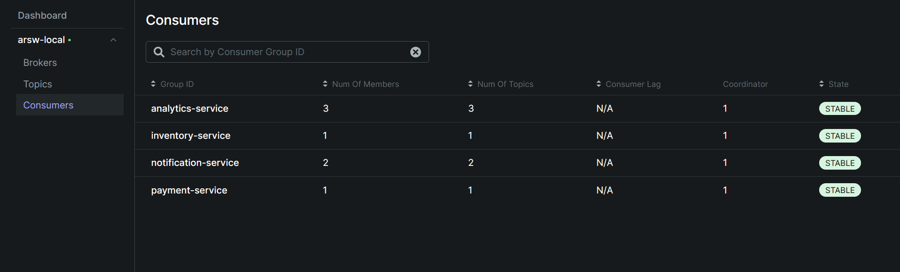

# EDA con Redis Streams — Demo Bancaria

Ejemplo de arquitectura orientada por eventos (EDA) con Spring Boot y Redis Streams.
Un ente **produce** un evento de transferencia bancaria, Redis lo transporta,
y tres entes independientes lo **consumen**.

```
Productor  ──XADD──►  Redis Stream  ──XREADGROUP──►  FraudeConsumer
                                                  ──XREADGROUP──►  NotificacionesConsumer
                                                  ──XREADGROUP──►  AuditoriaConsumer
```

---

## Cómo funciona

### Productor
`TransferenciaProducer` recibe un evento `TransferenciaCreada` y lo publica
en el stream `banco.transferencias` con `XADD`. Redis le asigna un ID único.

### Redis Stream
Actúa como canal de mensajes. Tiene tres **consumer groups** (uno por consumidor).
Cada grupo recibe todos los mensajes de forma independiente.

### Consumidores
Cada uno corre en su propio hilo, lee con `XREADGROUP` y confirma con `XACK`.

| Consumidor              | Qué hace                                            |
|-------------------------|-----------------------------------------------------|
| `FraudeConsumer`        | Alerta si el monto supera 10.000                    |
| `NotificacionesConsumer`| Simula una notificación al destinatario             |
| `AuditoriaConsumer`     | Guarda el evento en una lista en memoria            |

---

## Estructura del proyecto

```
com.eci.arsw.eda
├── domain/      TransferenciaCreada  (el evento)
├── config/      RedisStreamConfig    (crea el stream y los grupos al arrancar)
├── producer/    TransferenciaProducer
├── consumer/    BaseConsumer, FraudeConsumer, NotificacionesConsumer, AuditoriaConsumer
├── manager/     ConsumerManager      (lanza los hilos)
└── controller/  TransferenciaController
```

---

## Levantar Redis con Docker

```bash
docker run --name redis-eda -p 6379:6379 -d redis:7
```

---

## Correr la aplicación

```bash
mvn spring-boot:run
```

---

## Endpoints

| Método | URL                           | Descripción                          |
|--------|-------------------------------|--------------------------------------|
| POST   | `/api/transferencias`         | Publica un evento (body opcional)    |
| GET    | `/api/transferencias/auditados` | Total guardado por auditoría       |

---

## Probar con curl

**Publicar una transferencia:**
```bash
curl -s -X POST http://localhost:8080/api/transferencias \
  -H "Content-Type: application/json" \
  -d '{"from":"ACC-001","to":"ACC-002","amount":"500.00","currency":"COP"}'
```

**Sin body (usa valores demo):**
```bash
curl -s -X POST http://localhost:8080/api/transferencias
```

**Publicar una transferencia sospechosa (activa alerta de fraude):**
```bash
curl -s -X POST http://localhost:8080/api/transferencias \
  -H "Content-Type: application/json" \
  -d '{"from":"ACC-001","to":"ACC-099","amount":"50000.00","currency":"COP"}'
```

**Ver cuántas transferencias auditó el AuditoriaConsumer:**
```bash
curl http://localhost:8080/api/transferencias/auditados
```

---

## Salida esperada en consola

```
[Productor]       Evento publicado en Redis -> 1750710234567-0
[Fraude]          OK: transferencia abc-123 por 500.00 COP
[Notificaciones]  Enviando notificacion a 'ACC-002': recibiste 500.00 COP de 'ACC-001'
[Auditoria]       Guardado: transferencia abc-123 por 500.00 COP
```

---

## Evidencias

> Nota: estas capturas provienen del laboratorio de Kafka (`KAFKA-ARSW`), no de
> este proyecto de Redis Streams. Se incluyen aquí a solicitud explícita, no
> como evidencia de ejecución de este laboratorio.

**Cluster / UI del broker de mensajería**



**Topics**



**Llamadas curl (equivalente a probar el endpoint de publicación)**





**Consumer groups / lag**



---

## Evidencias reales de este laboratorio (Redis Streams)

Ejecución real del `2026-07-15`, con Redis 7 corriendo en Docker (`redis-eda`) y la
app levantada con `mvn spring-boot:run`.

### 1. Arranque: creación/verificación de los 3 grupos de consumidores

```
[ConsumerManager] Consumidores iniciados
[notif-consumer-1] Escuchando...
[auditoria-consumer-1] Escuchando...
[fraude-consumer-1] Escuchando...
[Redis] Grupo ya existe: fraude-group
[Redis] Grupo ya existe: notif-group
[Redis] Grupo ya existe: auditoria-group
```

### 2. Flujo completo: publicar → persistir → consumir → confirmar

**Request 1 — transferencia normal:**
```bash
curl -s -X POST http://localhost:8080/api/transferencias \
  -H "Content-Type: application/json" \
  -d '{"from":"ACC-001","to":"ACC-002","amount":"500.00","currency":"COP"}'
```
```json
{"recordId":"1784093069684-0","currency":"COP","amount":500.00,"eventId":"60964b9b-db0d-4cb9-82b6-dd0ae3f36507","transferId":"c8f49d25-0fb3-4c74-8ca6-281001d9f908"}
```

**Request 2 — transferencia sospechosa (activa alerta de fraude):**
```bash
curl -s -X POST http://localhost:8080/api/transferencias \
  -H "Content-Type: application/json" \
  -d '{"from":"ACC-001","to":"ACC-099","amount":"50000.00","currency":"COP"}'
```
```json
{"recordId":"1784093069844-0","currency":"COP","amount":50000.00,"eventId":"16df3efa-5768-43c2-bfd6-1b9dbe17b5dc","transferId":"b513711e-f152-4ac8-bca2-bdf32a0d5fa1"}
```

**Salida real de consola de la app (los 3 consumidores reaccionan a cada evento, cada uno con su propio grupo):**
```
[Productor] Evento publicado en Redis -> 1784093069684-0
[Notificaciones] Enviando notificacion a 'ACC-002': recibiste 500,00 COP de 'ACC-001'
[Auditoria] Guardado: transferencia c8f49d25-0fb3-4c74-8ca6-281001d9f908 por 500,00 COP
[Fraude] OK: transferencia c8f49d25-0fb3-4c74-8ca6-281001d9f908 por 500,00 COP
[Productor] Evento publicado en Redis -> 1784093069844-0
[Auditoria] Guardado: transferencia b513711e-f152-4ac8-bca2-bdf32a0d5fa1 por 50000,00 COP
[Fraude] ALERTA: transferencia b513711e-f152-4ac8-bca2-bdf32a0d5fa1 por 50000,00 COP supera el umbral
[Notificaciones] Enviando notificacion a 'ACC-099': recibiste 50000,00 COP de 'ACC-001'
```

**Verificación del consumidor de auditoría:**
```bash
curl -s http://localhost:8080/api/transferencias/auditados
# {"totalAuditados":2}
```

### 3. Actividad sugerida: simular la caída de un consumidor antes del `XACK`

Para no interferir con los grupos reales de la app (`fraude-group`, `notif-group`,
`auditoria-group`), la simulación se hizo con un grupo de consumidores temporal
(`demo-crash-group`) sobre el mismo stream `banco.transferencias`, usando
`redis-cli` directamente contra el contenedor.

**Paso 0 — crear el grupo de la demo y publicar un evento nuevo:**
```bash
docker exec redis-eda redis-cli XGROUP CREATE banco.transferencias demo-crash-group '$'
curl -s -X POST http://localhost:8080/api/transferencias \
  -H "Content-Type: application/json" \
  -d '{"from":"ACC-777","to":"ACC-888","amount":"12345.00","currency":"COP"}'
```
```
OK
{"recordId":"1784093093854-0", ...}
```

**Paso 1 — `crash-consumer-1` lee el evento pero "muere" antes de hacer `XACK`:**
```bash
docker exec redis-eda redis-cli XREADGROUP GROUP demo-crash-group crash-consumer-1 \
  COUNT 1 STREAMS banco.transferencias '>'
```
```
banco.transferencias
1784093093854-0
eventId d03fc416-6a85-4a1b-8f5d-6efa8de179a9
amount  12345.00
from    ACC-777
to      ACC-888
...
```

**Paso 2 — se comprueba que el evento quedó pendiente (sin confirmar):**
```bash
docker exec redis-eda redis-cli XPENDING banco.transferencias demo-crash-group
```
```
1                          # 1 mensaje pendiente
1784093093854-0            # ID menor
1784093093854-0            # ID mayor
crash-consumer-1            1   # asignado a crash-consumer-1, nunca confirmado
```

**Paso 3 — `recovery-consumer-1` reclama el mensaje huérfano con `XCLAIM` y lo confirma:**
```bash
docker exec redis-eda redis-cli XCLAIM banco.transferencias demo-crash-group recovery-consumer-1 0 1784093093854-0
docker exec redis-eda redis-cli XACK banco.transferencias demo-crash-group 1784093093854-0
```

**Paso 4 — ya no quedan mensajes pendientes:**
```bash
docker exec redis-eda redis-cli XPENDING banco.transferencias demo-crash-group
# (vacío)
```

**Conclusión de la simulación:** confirma lo que dice la teoría (slide 8/9 de la
clase) — Redis Streams no pierde el evento si el consumidor cae antes del `XACK`;
queda visible en `XPENDING` y cualquier otro consumidor del grupo puede
reclamarlo con `XCLAIM` y reintentar el procesamiento sin duplicar la publicación
original.
